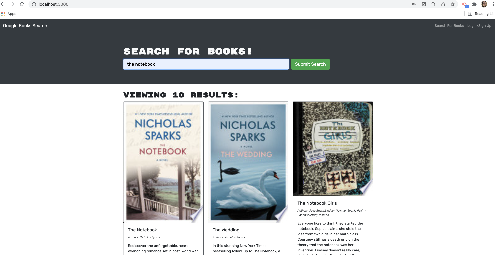

# Book Search Engine 

## Summary

This challenge is to take a fully functioning Google Books API search engine built with a RESTful API, and refactor it to be a GraphQL API built with Apollo Server. The app was built using the MERN stack, with a React front end, MongoDB database, and Node.js/Express.js server and API.

## Table of Contents 
* [Summary](#summary)
* [Tools Used](#tools-used)
* [Snapshots](#snapshot)
* [Installation](#installation)
* [Heroku](#heroku)
* [Questions](#questions)

## Tools Used

* JavaScript
* Node.js
* Express
* React
* Apollo Server
* Graphql
* Mongodb
* Mongoose
* Dotenv
* Heroku

## Snapshot

# Installation 
* To use this app npm init has to be called to create your package.json file.
* The necessary npm dependencies must be installed to run the application properly and can be found on the package.json file.
* To properly install the database you must create a cluster on Mongodb atlas.
* Run "npm start" for the port to start listening with mongoose.
* This app is deployed on Heroku

# Heroku

()

## Questions?
If you have any questions about the repo, please send an [email](mailto:andiconner@icloud.com). You can find more of my work at  [my gitub profile page](https://github.com/andiconner)

